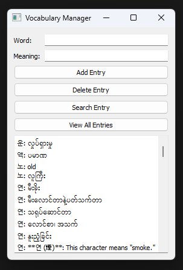

### sqlite-personal-dictionary

## Installation
#### Windows

Download the installer from the Releases section.

#### Linux

Clone or download this repository and use it as desired. If you want to add this software to your application search, there is a bash script included. If you are new to linux, use `bash install.sh` to install. This script will:

1. Add the `sqlite-personal-dictionary` folder to `/usr/bin/`.
2. Add a `pdict` alias to your `.bashrc`.
3. Copy `sqlite-personal-dictionary.desktop` to `~/.local/share/applications/` so you can access it from the application search.

Make sure to reload your `.bashrc` or restart your terminal for the alias to take effect

## How I made it
I believe the Korean language is similar to my native Burmese in many ways. One key similarity is that the composition of each word is made up of base syllables, each with its own meaning. This project was born out of a desperate need because my INTP brain struggles to memorize vocabulary without breaking it down into these base components.

I used to take notes in obsidian, headline for the title and lists under each title for their similar meanings. Then I use to look for the syllable I wanted with search function(ctrl + f). As my file grows larger, the searching become laggy and the whole process become buggy. I looked for other projects that could fulfill my needs. I thought Stardict and Goldendict might work since they are dictionary software, but they lack the ability to frequently update with new vocabulary. Initially, I was hesitant to create my own app because I didn't have much time, and I was skeptical about how much work it would require. However, I realized all I needed was a simple database and a Python interface. So, I asked ChatGPT for help with most of the code and tweaked it to fit my workflow. Now, this project is exactly what I needed.

You can also use this program as your personal dictionary. The functionality is straightforward: you can add new words, search for them, and delete them. For me, the best part is the keyboard shortcuts. Pressing "Enter" in the word panel triggers a search, while pressing "Enter" in the meaning panel adds a new entry. To delete an entry, you need to fill in both the word and meaning panels. I use this program to add new syllable meanings as I come across them. When I encounter a new word, I try to guess its meaning based on its syllables. Thanks to this program, my vocabulary memorization workflow is twice as fast.

I call it a "personal dictionary" because it functions similarly to a traditional dictionary app. But as I mentioned, I use it primarily to break down vocabulary and collect the meanings of base syllables, which is essential for my INTP brain.

#### Keyboard shortcuts
- ctrl + s >> Search Entry
- ctrl + d >> Delete Entry

### screenshots
##### on windows barebone

##### on linux tailored

##### syllable/combinations

##### view all entries
  

